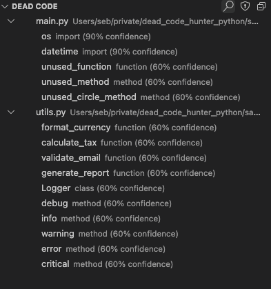

# Dead Code Finder

A VSCode extension that helps you find and remove unused code in your projects.



## Features

- **Dead Code Detection**: Find unused functions, methods, classes, and imports
- **Interactive UI**: View unused code in a custom tree view
- **Code Navigation**: Quickly navigate to dead code locations
- **Inline Diagnostics**: See warnings directly in your editor
- **Whitelist Support**: Exclude intentional unused code from analysis
- **Configurable**: Adjust confidence thresholds and other settings

Currently supports:
- Python (via Vulture)

## Requirements

- Visual Studio Code v1.99.0 or higher
- Python 3.6+ (for Python code analysis)
- Vulture (will be automatically installed if not present)

## Installation

### From VSIX File (Local Installation)

1. Build the extension locally (see [Development](#development) section)
2. In VSCode, go to Extensions view (Ctrl+Shift+X)
3. Click on the '...' menu (top-right) and select 'Install from VSIX...'
4. Navigate to the generated .vsix file and select it

### From Marketplace (Coming Soon)

1. Open VSCode
2. Go to Extensions view (Ctrl+Shift+X)
3. Search for "Dead Code Finder"
4. Click Install

## Usage

### Analyzing Code

1. Open a Python project in VSCode
2. Run one of these commands:
   - **Find Dead Code: Analyze Workspace** - Analyze all Python files in the workspace
   - **Find Dead Code: Analyze Current File** - Analyze only the current file

### Viewing Results

Results are displayed in two ways:
1. **Dead Code Explorer** - A tree view showing all detected dead code grouped by file
2. **Inline Diagnostics** - Warnings displayed directly in your editor

### Working with Results

- Click on any item in the Dead Code Explorer to navigate to its location
- Right-click on items for additional options:
  - **Open Dead Code Location** - Jump to the code
  - **Add Item to Whitelist** - Add this item to your whitelist

### Generating a Whitelist

For code that's intentionally unused (like backup functions or placeholder methods):

1. Right-click on a dead code item and select "Add Item to Whitelist"
2. Or use the "Generate Whitelist File" button in the Dead Code Explorer view
3. The extension will create a whitelist file compatible with Vulture

## Extension Settings

This extension contributes the following settings:

* `deadCodeFinder.minConfidence`: Minimum confidence threshold (0-100) for reporting dead code
* `deadCodeFinder.enableAutoAnalysis`: Enable automatic analysis on file save
* `deadCodeFinder.showDiagnostics`: Show inline diagnostics for dead code in editor
* `deadCodeFinder.excludePatterns`: Glob patterns for files to exclude from analysis
* `deadCodeFinder.whitelistFile`: Path to whitelist file for intentional dead code
* `deadCodeFinder.logLevel`: Log level for the extension (debug, info, warn, error)

## Development

### Prerequisites

- Node.js and npm
- Visual Studio Code

### Building and Running Locally

1. Clone the repository:
   ```
   git clone https://github.com/sebastienfi/dead-code-finder.git
   cd dead-code-finder
   ```

2. Install dependencies:
   ```
   npm install
   ```

3. Build the extension:
   ```
   npm run compile
   ```

4. Run the extension in development mode:
   - Press F5 in VSCode to launch a new window with the extension loaded
   - Or run `npm run watch` to automatically rebuild on changes

### Testing with Sample Projects

The repository includes sample Python projects with intentional dead code for testing:

1. Open the sample project folder:
   ```
   cd samples/dead_code_example
   ```

2. In the VSCode instance with the extension running, open this folder
3. Run the "Find Dead Code: Analyze Workspace" command
4. Verify that the extension correctly identifies the unused code

### Building VSIX Package

To create a VSIX file for installation:

```
npm run package
```

This creates a `.vsix` file in the root directory that can be installed in VSCode.

### Running Tests

```
npm run test
```

## Known Issues

- Currently only supports Python via Vulture integration
- Large projects may take longer to analyze
- Some custom Python patterns may generate false positives

## Roadmap

- Support for additional languages (JavaScript/TypeScript)
- Performance optimizations for larger codebases
- Statistics and metrics for dead code
- Integration with other code quality tools
- Automatic refactoring suggestions

## Contributing

Contributions are welcome! Please feel free to submit a Pull Request.

## License

This project is licensed under the MIT License - see the LICENSE file for details. 